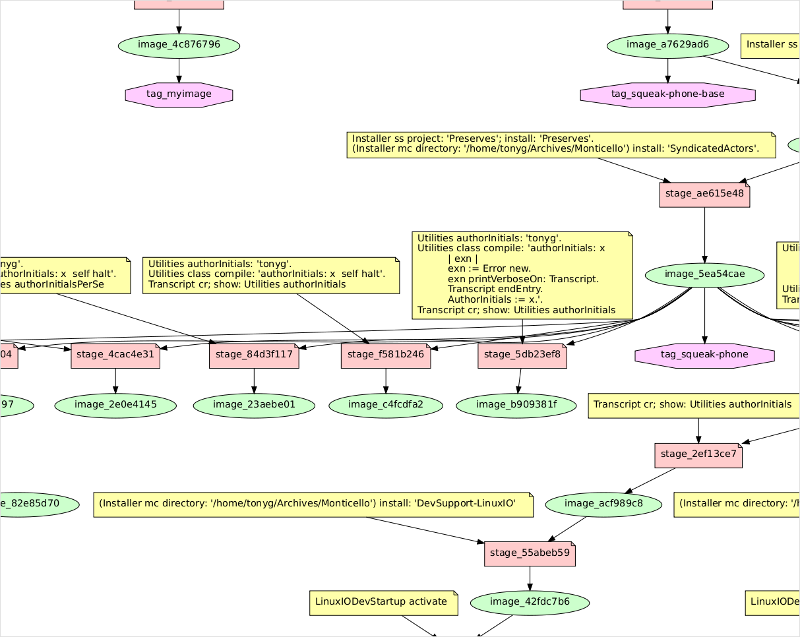

# Squeaker

Like Docker, but for Smalltalk images. [You know, for
kids.](https://www.youtube.com/watch?v=8UxAlkaTWLc)

It's a small program that helps in automated derivation of
*configured* Smalltalk images from some fixed *base* image and a
collection of Smalltalk *commands*. It's about 500 lines of Python, so
far.

 - `Squeakerfile.st` is like `Dockerfile`, except it contains
   locations to fetch images from plus Smalltalk expressions to derive
   new images.

 - `squeaker build` is like `docker build`. It manages a cache (in
   `$XDG_CACHE_HOME/squeaker`, usually `$HOME/.cache/squeaker` on
   Unix) of downloaded artifacts, derived images, and the stages in
   each derivation.

 - `squeaker run` is like `docker run`. It starts a
   previously-downloaded or -derived image in a temporary directory.
   (Future: support persistent image instances, like docker does! Easy
   enough.)

 - `squeaker gc` is like `docker system prune`, roughly. It cleans out
   the Squeaker cache directory, treating tags as GC roots.

## Installation

Install Python 3.x (I used 3.9 to build it), making sure `python3` is
on the `PATH`.

Make sure [`squeaker`](./squeaker) is on the `PATH`, too.

## Usage

You can type "`squeaker --help`" and "`squeaker` *subcommand*
`--help`" for terse usage information.

## Downloading and customising images

The `Squeakerfile.st` specifying a build is written using
[`!`-delimited chunk][chunks1] format (see also [here][chunks2] and
[below](#chunk-format)). A chunk starting with `from:` specifies either

 - A URL, if the argument to `from:` is a Smalltalk string literal,
   e.g.

       from: 'http://files.squeak.org/6.0alpha/Squeak6.0alpha-20582-64bit/Squeak6.0alpha-20582-64bit.zip'

   The URL must point to a ZIP file containing at least one `*.image`
   file and a matching `*.changes` file.

 - A tag, previously defined using `squeaker build -t ...`, if the
   argument to from is a *quoted* Smalltalk *symbol* literal, e.g.

       from: #'myimage'

Other chunks are snippets of Smalltalk to execute to configure the
image, deriving another image. Chunks are applied in sequence.
Squeaker caches intermediaries, like Docker does, to avoid repeated
work.

Let's work with the following `Squeakerfile.st`:

```smalltalk
from: 'http://files.squeak.org/6.0alpha/Squeak6.0alpha-20582-64bit/Squeak6.0alpha-20582-64bit.zip'!

World submorphs
    select: [:m |
        (m isKindOf: PreferenceWizardMorph) or:
            [m isSystemWindow and: [m label beginsWith: 'Welcome to Squeak']]]
    thenDo: [:m | m delete].
!

"Apply my preferences!!"
CommunityTheme createDark apply.
Model useColorfulWindows: true.
[Preferences setDemoFonts] valueSupplyingAnswer: true.
Cursor useBiggerCursors: true.
Preferences enable: #mouseOverForKeyboardFocus.
TextEditor autoEnclose: false.
Model windowActiveOnFirstClick: true.
!

MCMcmUpdater default doUpdate: false.
!

Metacello new configuration: 'FFI'; load.
Installer ss project: 'OSProcess'; install: 'OSProcess'.
!
```

Use `squeaker build` to build it. Here, I will tag the final image as
`myimage`:

```
$ squeaker build -t myimage -f Squeakerfile.st .
INFO:root:Downloading http://files.squeak.org/6.0alpha/Squeak6.0alpha-20582-64bit/Squeak6.0alpha-20582-64bit.zip
INFO:root:  20519402/20519402 (100%) http://files.squeak.org/6.0alpha/Squeak6.0alpha-20582-64bit/Squeak6.0alpha-20582-64bit.zip
INFO:root:  51209408/51209408 (100%) extracting: Squeak6.0alpha-20582-64bit.image
INFO:root:  20374964/20374964 (100%) extracting: Squeak6.0alpha-20582-64bit.changes
INFO:root: --- 2d3e365261fa70f3ae6b
INFO:root:Running:
    World submorphs
    	select: [:m |
    		(m isKindOf: PreferenceWizardMorph) or:
    			[m isSystemWindow and: [m label beginsWith: 'Welcome to Squeak']]]
    	thenDo: [:m | m delete].
INFO:root:    execution: 0.249 seconds
INFO:root:  58630352/58630352 (100%) archiving: squeak.image
INFO:root:  20376501/20376501 (100%) archiving: squeak.changes
INFO:root:    archiving: 2.182 seconds
INFO:root:  58630352/58630352 (100%) extracting: squeak.image
INFO:root:  20376501/20376501 (100%) extracting: squeak.changes
INFO:root: --- a65c4397156194b571d7
INFO:root:Running:
    "Tony's preferences!"
    CommunityTheme createDark apply.
    Model useColorfulWindows: true.
    [Preferences setDemoFonts] valueSupplyingAnswer: true.
    Cursor useBiggerCursors: true.
    Preferences enable: #mouseOverForKeyboardFocus.
    TextEditor autoEnclose: false.
    Model windowActiveOnFirstClick: true.
INFO:root:    execution: 0.619 seconds
INFO:root:  62905552/62905552 (100%) archiving: squeak.image
INFO:root:  20378159/20378159 (100%) archiving: squeak.changes
INFO:root:    archiving: 2.289 seconds
INFO:root:  62905552/62905552 (100%) extracting: squeak.image
INFO:root:  20378159/20378159 (100%) extracting: squeak.changes
INFO:root: --- e80909c4f1f2f14324b2
INFO:root:Running:
    MCMcmUpdater default doUpdate: false.

MethodNode>>asColorizedSmalltalk80Text (TextStyler is Undeclared) 
==========  Update completed:  20582 -> 20678 ==========
INFO:root:    execution: 22.103 seconds
INFO:root:  57047392/57047392 (100%) archiving: squeak.image
INFO:root:  20540949/20540949 (100%) archiving: squeak.changes
INFO:root:    archiving: 2.135 seconds
INFO:root:  57047392/57047392 (100%) extracting: squeak.image
INFO:root:  20540949/20540949 (100%) extracting: squeak.changes
INFO:root: --- 9e4bcce29c3dba7dd48e
INFO:root:Running:
    Metacello new configuration: 'FFI'; load.
    Installer ss project: 'OSProcess'; install: 'OSProcess'.
 ⋮
 (output from Metacello and OSProcess installation elided)
 ⋮
loaded
INFO:root:    execution: 45.081 seconds
INFO:root:  69034504/69034504 (100%) archiving: squeak.image
INFO:root:  24673049/24673049 (100%) archiving: squeak.changes
INFO:root:    archiving: 2.535 seconds
INFO:root:Tagging 4c8767963a0bc6ce727b as 'myimage'
4c8767963a0bc6ce727bbbdb787e7a51c36fe27fff53dfcd4e84a8f4ad13872c858e4351262ba00d8d649bf474e28e515816a0774a8a30fc4c88039985e6b4b6

$
```

## Running images

Now I can get a transient, disposable image in a temporary directory
which will be deleted when the VM process terminates, by running

```
$ squeaker run myimage
INFO:root:Image: 4c8767963a0bc6ce727bbbdb787e7a51c36fe27fff53dfcd4e84a8f4ad13872c858e4351262ba00d8d649bf474e28e515816a0774a8a30fc4c88039985e6b4b6
INFO:root:  69034504/69034504 (100%) extracting: squeak.image
INFO:root:  24673049/24673049 (100%) extracting: squeak.changes
```


If I want to keep this image, I have to take care to `Save as...` to
some other directory!

## Garbage collection

During development, and after a bit of normal usage, you'll find you
have a lot of unwanted intermediary images saved in the cache. You can
discard those not reachable from some tag using `squeaker gc`.

Use `squeaker gc --dry-run` to get a description of what will be
deleted, without deleting anything.

You can also get a picture of the (live) contents of your cache by
running the [Graphviz](https://graphviz.org/)
[dot](https://graphviz.org/doc/info/lang.html) tool over the output of
the `squeaker dot` command.

Here's the kind of thing it looks like:



## Chunk format

"Chunk" format ([1][chunks1], [2][chunks2]) is an old, old
Smalltalkism. It's a *binary* file, using byte 0x21 (`!`) as
delimiter. Exclamation points are *doubled* to escape them: so the
chunk containing the text `Hello! How are you?` is written

    Hello!! How are you?!

The final `!` terminates the chunk; the embedded `!!` decodes to a
single `!`.

[chunks1]: http://wiki.squeak.org/squeak/1105
[chunks2]: https://live.exept.de/doc/online/english/programming/fileoutFormat.html

## License and Copyright

([MIT](https://opensource.org/licenses/MIT).)

Copyright 2021 Tony Garnock-Jones <tonyg@leastfixedpoint.com>

Permission is hereby granted, free of charge, to any person obtaining
a copy of this software and associated documentation files (the
"Software"), to deal in the Software without restriction, including
without limitation the rights to use, copy, modify, merge, publish,
distribute, sublicense, and/or sell copies of the Software, and to
permit persons to whom the Software is furnished to do so, subject to
the following conditions:

The above copyright notice and this permission notice shall be
included in all copies or substantial portions of the Software.

THE SOFTWARE IS PROVIDED "AS IS", WITHOUT WARRANTY OF ANY KIND,
EXPRESS OR IMPLIED, INCLUDING BUT NOT LIMITED TO THE WARRANTIES OF
MERCHANTABILITY, FITNESS FOR A PARTICULAR PURPOSE AND NONINFRINGEMENT.
IN NO EVENT SHALL THE AUTHORS OR COPYRIGHT HOLDERS BE LIABLE FOR ANY
CLAIM, DAMAGES OR OTHER LIABILITY, WHETHER IN AN ACTION OF CONTRACT,
TORT OR OTHERWISE, ARISING FROM, OUT OF OR IN CONNECTION WITH THE
SOFTWARE OR THE USE OR OTHER DEALINGS IN THE SOFTWARE.

